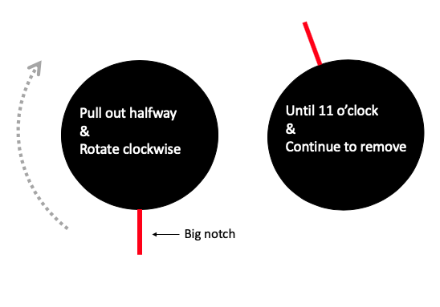
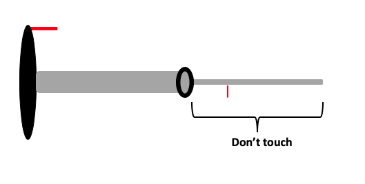

# Load Sample

Once the beam is found and centered we can load the sample. We need to start by turning the T12 off so we can remove the sample holder. This process is the reverse of the "Startup". 

1)  Turn off filament

2) Col. Valves Closed

    **wait until filament is off**

3) Reset Holder (check to see x, y, and z are all close to "0, 0, 0")

4) Remove sample holder (this is a little tricky and is done in steps)

      - Pull out **gently** on sample holder until it resists _and don't pull any farther_
      - Rotate holder to ~11 o'clock and pull all the way out. 
      
```{r echo=FALSE, fig.cap= 'Schematic of removing sample holder'}

```

**BE CAREFUL LOADING SAMPLE HOLDER IN & OUT. USE COMMON SENSE DON'T FORCE ANYTHING**


5) Load Sample
    - Do not ever touch sample holder below rubber o-ring
    
```{r echo=FALSE, fig.cap= 'Side view of sample holder'}

```
    
6) Put sample holder back into T12
    - Line up the small pin (below the o-ring) with the "close" on the T12. The big notch 
      should be around 11 o'clock.
    - Push in halfway until you feel it "catch". If done correctly the vacuum pump timer on         the left monitor will jump down to 2 min. 
    - Wait the 2 minutes for the vacuum pump to turn off, rotate sample holder 60 degrees so        the big notch lines up with the slot in the T12, and place in the scape. Try to do this       step in one smooth quick motion. **DO NOT LET GO**. There will be some pressure from the       vacuum sucking the holder in. 
    
    
The sample is now in the scope ready to be imaged. 
